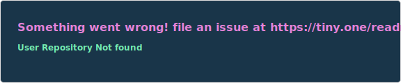

   
   

     
    
    
  

  

  

  <a href="https://buymeacoffee.com/tsvetang">You can Support Me Here!</a>

   
   

**` Software Developer / Power Developer / Automation Specialist `**

## &nbsp;**`About Me`**
Hi, welcome to my profile. I'm a Software Developer with ambition for automation and AI Agent development. You can find more about me, my stack, my passions & projects below. Enjoy!

## &nbsp;**`Tech Stack`**
### **`Languages & Scripts`**
| Python3 | Robocorp | VBA | JavaScript | Cognigy Script | PowerFX |
|----------|----------|----------|----------|----------|----------|
|   | |||| 

### **`Others`**

| Git | Docker | Pycharm | Visual Studio | Power Automate | Jupyter | N8N | Power Platform | HubSpot | Make.com | Claude | Django | Node.js | Flask |
|----------|----------|----------|----------|--------|-----|----------|-------|----------|--------|----------|----------|----------|----------|
|  |||||||||| | ||

                                       
## &nbsp;**`Analytics`**

  
  

   
   

## &nbsp;**`Latest Projects`**

   
  
  
  

   
   

